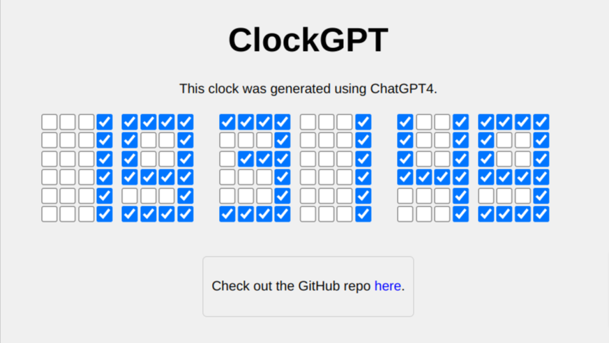

# ClockGPT

[ClockGPT](https://clock-gpt.web.app/) is a digital clock web page that displays the current time using a 4x6 grid of checkboxes, styled to resemble a 7-segment display. This project was generated using ChatGPT4, an advanced language model developed by OpenAI.



## Features

- Displays the current time with hours, minutes, and seconds
- Updates every second for a live, accurate time display
- Time represented using a 4x6 grid of checkboxes to mimic a 7-segment display
- Designed and generated with the help of OpenAI's ChatGPT4

## How it was generated

ClockGPT was generated with the assistance of ChatGPT4, an advanced language model developed by OpenAI. The user interacted with the AI through a series of questions and answers, refining the solution iteratively until the desired outcome was achieved.

## Usage

1. Clone the repository:

```bash
git clone https://github.com/vishnuharidas/clock-gpt
```

2. Open the `index.html` file in your preferred web browser.

## Copyright Notice

Copyright © 2023 [Vishnu Haridas](https://blog.qburst.com/author/vishnuh/) & [QBurst](https://qburst.com). All rights reserved.

This project is provided for personal, non-commercial use only. Redistribution or modification without the express permission of the copyright holder is strictly prohibited.

---

(This README file is completely generated by ChatGPT4)
